# titanic

In this problem we have to predict if a person survives given his information. 
this is a basic machine learning question.if you are new to machine learning this is good place to start 

lets jump straight to it. 

we import all required libraries
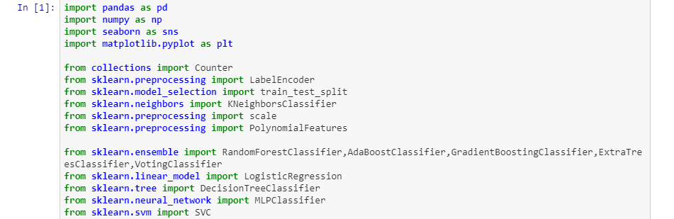

load our csv files containing dataset and print out first five rows from it
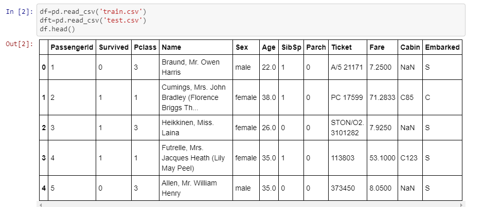

just to see how our survive rate looks like with age we plot it using seaborn library
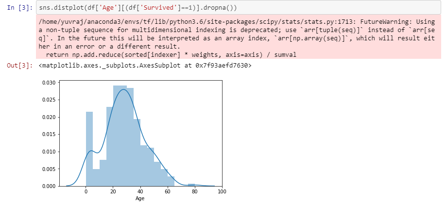

now we want to remove outliers from our dataset to have better results. 
to do that what we do is 1st we use np.percentile function. 
what it does is basically arrange our given column in ascending order then we choose 2 Q values which are at Q1=25% and Q2=75% of data. 
it means if 100 no were given we arrange our data in ascendng oder and then choose no at pos 25 and pos 75. 
after we have these nos we choose step=1.5x(Q1-Q2) and we remove those rows whose more then 2 columns were having values greater then Q1-step or Q2+step.
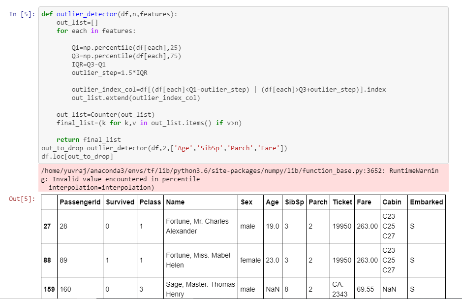

simply dropped those outliers and check what null values we have in our dataset. 
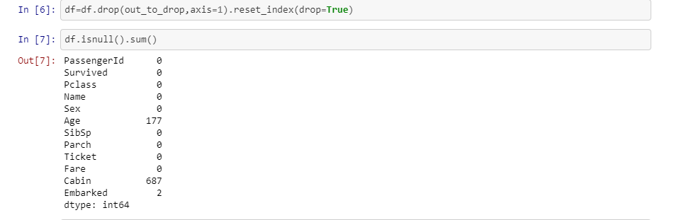

fill those NaN values with whatever suits you best
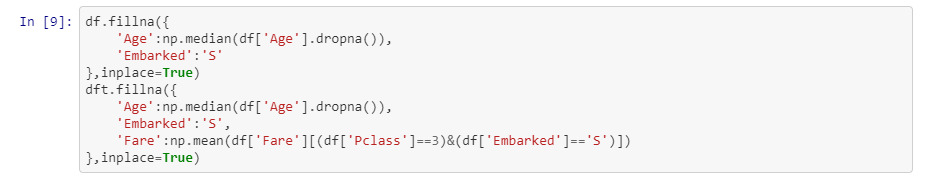

now since our some data contain strings and to apply any model we need to pass numerical values we have to replace those strings with numerical values 
we do that by using label encoder function what basically does is if we have feature gender(male,female) it will assign one of them to 0 and another one to 1
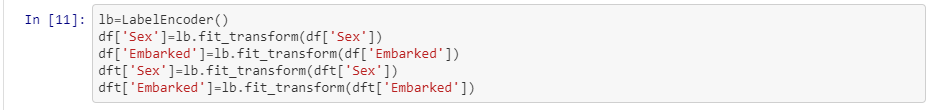

now we remove those columns which seems not to be of any use and take the rest as a matrix
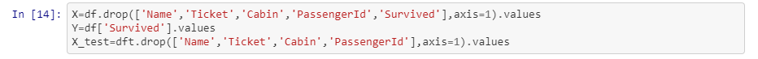

suppose you have columns x1,x2,x3 and if we use this function with degree 2 it will change it into x1,x2,x3,x1^2,x2^2,x3^2,x1*x2 and so on. 
(you may not do this as it is not required and will just increase our computation time)
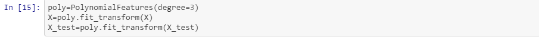

scale all values of our features according to their maximum value of each features
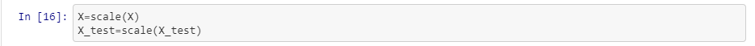

split our data set for validation
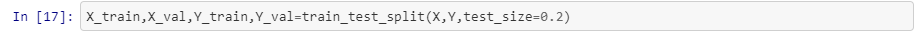

train our model
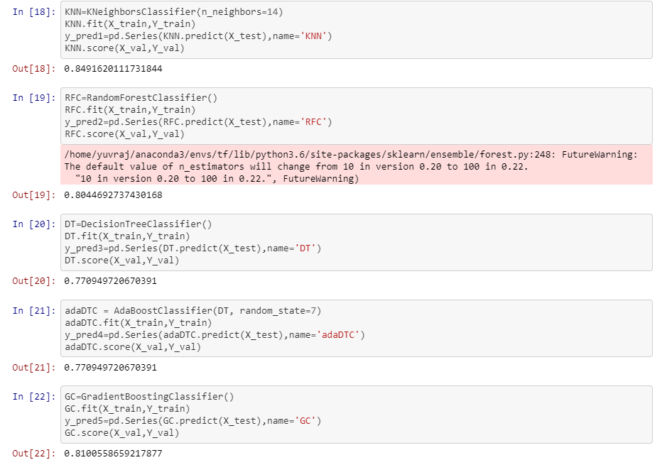

plot a heatmap to see correlation between your predictions with each model
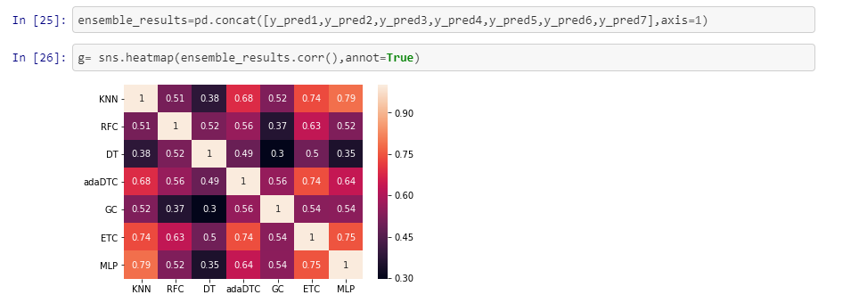

use voting classifier what it does is use al given models and give best results using predictions from models used above. 
predict for our test case
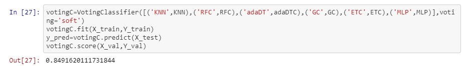

submit Test Case
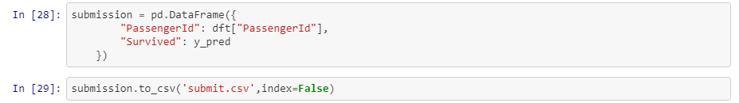

*please share if this helped* :)
